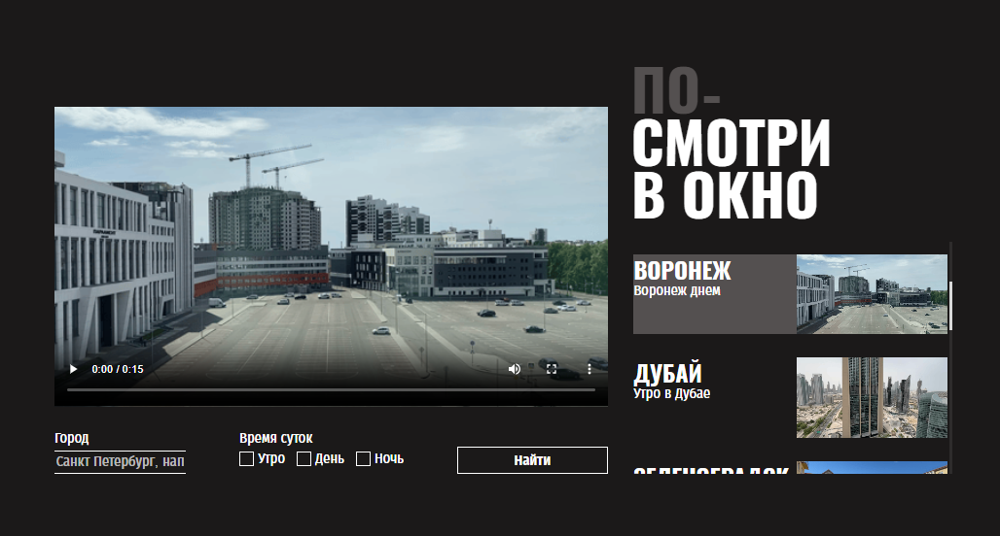

# Посмотри в окно

Веб-приложение для просмотра видео из окон разных городов мира в разное время суток.

## Результат



## Описание

Пользователь может искать видео по названию города и времени суток (утро, день, ночь). При выборе карточки из списка соответствующее видео загружается в основной плеер.

## Технологии

- HTML, CSS, Vanilla JavaScript
- CSS Grid и Flexbox для вёрстки
- Кастомные элементы форм (чекбоксы, инпуты)
- CSS-анимация (прелоадер)

## Структура проекта

```
├── index.html
├── styles/
│   ├── style.css       — основные стили
│   ├── preloader.css   — стили прелоадера
│   └── error.css       — стили блока ошибки
├── scripts/
│   └── script.js       — логика приложения
└── fonts/
    ├── fonts.css
    ├── Oswald-Bold.*
    └── FiraSansCondensed-*
```

